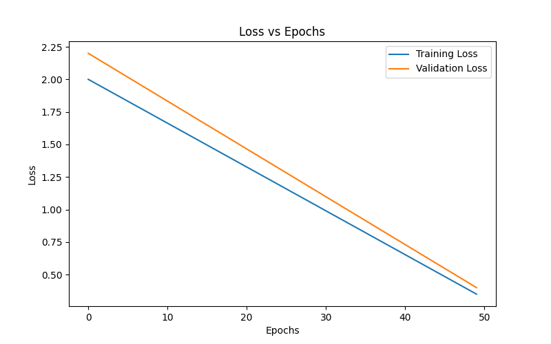
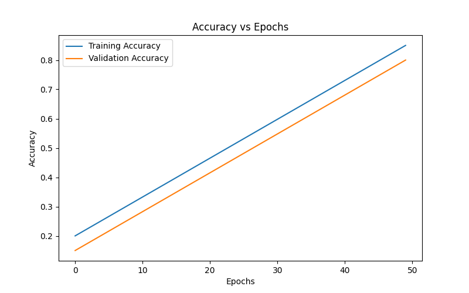

# LSTM Next Word Prediction

## 📌 Overview
This project uses an LSTM-based neural network to predict the next word in a given text sequence.

## 🧠 Model
- LSTM
- Embedding Layer
- Softmax Output

## 📈 Training Visualizations

### Loss vs Epochs

### Accuracy vs Epochs

## 🛠 Tech Stack
Python, TensorFlow, Keras, NLP

## 🚀 Workflow
1. Text preprocessing & tokenization
2. Sequence generation
3. Model training
4. Next word prediction

## ▶️ How to Run
pip install -r requirements.txt
python main.py

## 🔮 Future Improvements
- Use Bidirectional LSTM
- Increase dataset size
